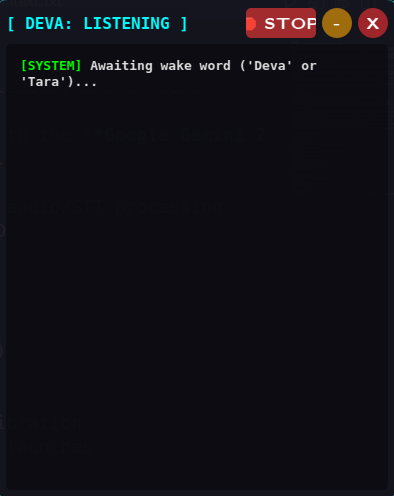

Markdown
# Deva AI: Dual-Persona Desktop Assistant for Linux

  

Deva AI is a privacy-first, dual-persona desktop voice assistant engineered natively for Linux environments. It dynamically routes user requests between a completely offline local LLM (for privacy and zero-latency tasks) and a cloud-based API (for real-world data retrieval), all wrapped in a multithreaded, hardware-accelerated GUI.

## 🧠 The Architecture (The Dual-Brain Concept)

Most commercial voice assistants force a compromise between privacy and capability. Deva AI solves this by acting as a smart router between two distinct "brains":

1. **Deva (Local Mode):** Activated by the wake word *"Deva"*. The system routes the query to an air-gapped **Meta Llama 3.2** model running locally via Ollama. This ensures 100% privacy, zero server rate limits, and offline capability.
2. **Tara (Web Mode):** Activated by the wake word *"Google"*. The system routes the query to the **Google Gemini 2.5 Flash API** to fetch real-world, up-to-date information that a local model cannot access.

To prevent UI freezing during heavy AI generation, the architecture strictly separates the audio/STT processing loop into a background worker thread, while the main thread manages the PyQt6 graphical HUD.

## ⚡ Tech Stack

* **Language:** Python 3
* **GUI Framework:** PyQt6 (Multithreaded architecture, frameless windows, dynamic styling)
* **AI Models:** Meta Llama 3.2 (Local) & Google Gemini API (Cloud)
* **Voice Synthesis (TTS):** Microsoft `edge-tts` (Neural TTS) & `gTTS`
* **Speech Recognition (STT):** `SpeechRecognition` library with dynamic ambient noise calibration
* **System Integration:** KDE Plasma `.desktop` execution & Bash scripting for native boot launches.

## ✨ Key Features

* **Smart Wake Word Routing:** Automatically detects whether to use the local LLM or cloud API based on the trigger word.
* **J.A.R.V.I.S. Neural Voice:** Utilizes Microsoft's edge-tts for high-fidelity, highly realistic voice synthesis without requiring a paid API key.
* **Cyberpunk Visual HUD:** A draggable, frameless desktop widget that displays a live text transcript of the conversation and dynamic state indicators (Listening, Processing, Idle).
* **Hardware-Safe Audio Engine:** Features a dedicated `Pygame` audio thread with an instant-kill "STOP" switch to gracefully interrupt long AI monologues and free up the microphone loop.
* **Native Linux Integration:** Boots silently in the background as a daemon process via KDE Plasma autostart scripts.

## 🚀 Installation & Setup

### Prerequisites
* Linux OS (Tested on KDE Plasma)
* Python 3.10+
* [Ollama](https://ollama.com/) installed and running.

### 1. Clone the Repository
```bash
git clone [https://github.com/GodwinKS/Deva-AI.git](https://github.com/GodwinKS/Deva-AI.git)
cd Deva-AI
2. Set Up the Virtual Environment
Bash
python3 -m venv assistant_env
source assistant_env/bin/activate
pip install -r requirements.txt
3. Install the Local Brain (Llama 3.2)
Ensure Ollama is running, then pull the local model:

Bash
ollama pull llama3.2
4. Configure API Keys
Create a .env file in the root directory and add your Google Gemini API key:

Ini, TOML
GEMINI_API_KEY=your_actual_api_key_here
5. Run the Engine
Bash
python3 gui_main.py
👨‍💻 Developer
Godwin K S Computer Science & Engineering www.linkedin.com/in/godwinks | [GITHUB](https://github.com/GodwinKS)

[](https://www.youtube.com/watch?v=Pg73K6MdaOE)
***

